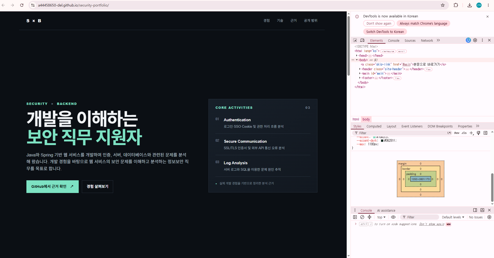
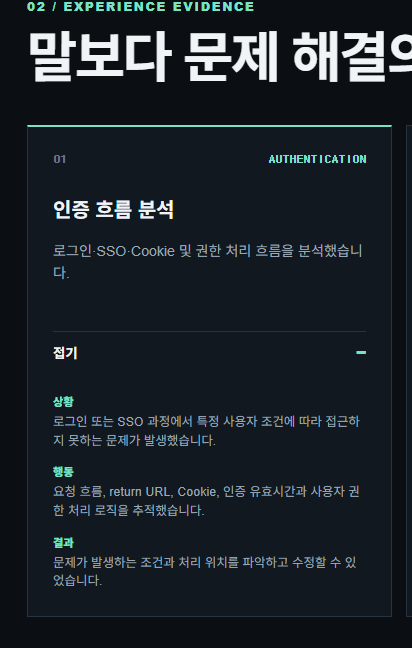

# 과제 1 학생 자체 점검표

> 제출용 문서입니다. GitHub 저장소에는 올리지 않습니다.

## 기본 정보

- 이름: ____________________
- 점검일: 2026-08-20
- 공개 주소: <https://seokgw.github.io/security-portfolio/>
- 공개 근거: <https://github.com/seokgw/security-portfolio>

## 1. 대상과 공개 범위

- [x] 대상 문장 1개가 페이지와 파일에 존재한다.
  - 대상 문장: 이 페이지는 정보보안 직무 채용 담당자에게 개발 경험과 보안 문제 해결 역량을 보여주기 위한 것입니다.
  - 확인 위치: 페이지의 `01 / TARGET`, `portfolio-scope.md`
- [x] 공개·비공개 범위 점검표가 존재한다.
  - 공개: 개발·보안 기술 스택, 문제 해결 경험, 공개 가능한 GitHub 자료
  - 비공개: 전화번호, 주소, 개인 이메일, 회사 내부 정보, 고객 데이터, 비밀번호, 토큰, API 키, 인증서 개인키
- [x] 공개하지 않기로 한 개인정보가 페이지와 제출 기록에 0건이다.
- [x] 실제 비밀번호·토큰·API 키 등 비밀값이 페이지와 배포 파일에 0건이다.

## 2. 강점과 공개 가능한 근거

- [x] 강점 3개가 같은 경험 영역에 제시되어 있다.
  1. 인증 흐름 분석
  2. SSL/TLS 통신 오류 분석
  3. 서버 로그와 SQL을 통한 문제 추적
- [x] 세 강점 모두 상황·행동·결과를 채웠다.
- [x] 확인할 수 없는 성과 수치나 수행하지 않은 보안 업무를 작성하지 않았다.
- [x] 공개 가능한 근거가 1개 이상 연결되어 있다.
  - 근거: 공개 GitHub 저장소와 현재 포트폴리오 결과물

## 3. 공개 주소와 첫 화면

- [x] 공개 주소가 Chrome에서 정상적으로 열린다.
- [ ] 다른 브라우저에서도 공개 주소가 정상적으로 열린다.
  - 확인한 브라우저: ____________________
  - 확인 결과: ____________________
- [x] 첫 화면에서 소개, 핵심 활동 3개, GitHub 근거 버튼이 함께 보인다.
- [x] 제공된 화면에서 Chrome Console의 빨간 오류가 0건이다.
- [ ] 1366×768에서 핵심 3개가 스크롤 없이 보인다.
- [ ] 1366×768에서 가로 넘침이 0건이다.
- [ ] 1920×1080에서 핵심 3개가 스크롤 없이 보인다.
- [ ] 1920×1080에서 가로 넘침이 0건이다.

현재 증빙:

## 4. 결함 수정과 콘솔 검사

- [x] 실제 결함 3개가 수정 전·수정·수정 후 형식으로 기록되어 있다.
  1. 작은 화면에서 내비게이션 소실
  2. 새 탭 열림 안내 누락
  3. 동작 줄이기 설정 미반영
- [x] 수정 내용이 실제 페이지 코드에 반영되어 있다.
- [x] 제공된 화면에서 Console 빨간 오류 0건을 확인했다.
- [ ] Console 탭을 크게 표시한 별도 증빙 화면을 첨부한다.

## 5. 상호작용과 키보드

- [x] 페이지 내용과 관련된 `인증 흐름 분석 — 자세히 보기` 상호작용이 있다.
- [x] 상호작용 실행 후 상황·행동·결과가 화면에 즉시 표시된다.
- [ ] 마우스로 눌렀을 때 상황·행동·결과가 즉시 펼쳐진다.
- [ ] `Tab`으로 버튼에 이동했을 때 포커스가 명확히 보인다.
- [ ] `Enter`로 펼치기와 접기가 작동한다.
- [ ] `Space`로 펼치기와 접기가 작동한다.
- [x] 운영체제의 동작 줄이기 설정을 존중하도록 구현되어 있다.
- [ ] 마우스·키보드 상호작용 증빙 화면 또는 짧은 화면 기록을 첨부한다.

현재 증빙:

## 6. 검증 안내서

- [x] `어디로 가나요`가 있다.
- [x] `무엇을 하나요`가 3단계 이내로 작성되어 있다.
- [x] `무엇이 보이면 통과인가요`가 있다.
- [x] `안 될 때`가 있다.
- [x] 공개 주소에서 바로 검증을 시작할 수 있다.

검증 절차:

1. 공개 주소를 연다.
2. 경험 영역에서 `자세히 보기`를 누른다.
3. `GitHub에서 근거 확인` 링크를 누른다.

## 7. AI 사용 기록

- [x] AI에게 맡긴 일: 포트폴리오의 초기 UI 구조와 반응형 레이아웃, 접근성 점검 항목 초안을 만드는 데 AI를 사용했다.
- [x] 내가 판단한 일: 실제 개발 경험 중 어떤 내용을 정보보안 직무와 연결할 수 있는지와 공개 가능한 범위를 직접 판단했다.
- [x] AI 말을 안 들은 일: 확인할 수 없는 성과 수치나 실제로 해보지 않은 보안 기술은 포트폴리오에 넣지 않았다.

## 추가 제출 증빙 목록

- [ ] `02-1366x768-수정후.png`
- [ ] `03-1920x1080-수정후.png`
- [ ] `04-console-오류0건.png`
- [x] `05-상호작용-상황행동결과.png`
- [ ] `06-상호작용-키보드-focus.png`
- [ ] 필요하면 짧은 상호작용 화면 녹화 파일

## 최종 확인

- 현재 확인 완료: 대상 문장, 공개·비공개 범위, 강점 3개, 공개 근거, 공개 주소, 첫 화면, 결함 기록, 제공 화면의 Console 오류 0건, 검증 안내서, AI 3줄
- 추가 확인 필요: 다른 브라우저, 정확한 두 해상도, 가로 넘침, 마우스·Tab·Enter·Space 상호작용 증빙
- 모든 미확인 항목을 직접 검사한 뒤 `[ ]`를 `[x]`로 변경한다.
